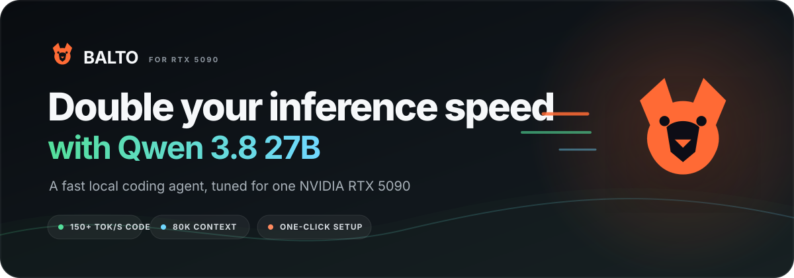

<p align="center">
  
</p>

<h1 align="center">Double your inference speed with Qwen 3.8 27B</h1>

<p align="center">
  <strong>One RTX 5090. One clean Windows install. A local coding agent that moves.</strong>
</p>

<p align="center">
  
  
  
  
</p>

<p align="center">
  <a href="https://github.com/jtc268/balto-speedrunner/releases/latest/download/Balto-Speedrunner-Windows-x64.exe">
    
  </a>
</p>

<p align="center"><sub>First launch downloads the inference engine and model. Keep at least 90 GB free.</sub></p>

<p align="center">
  <a href="#what-the-installer-does"><strong>How it works</strong></a>
  &nbsp;&nbsp;•&nbsp;&nbsp;
  <a href="#measured-on-our-rtx-5090"><strong>Benchmarks</strong></a>
  &nbsp;&nbsp;•&nbsp;&nbsp;
  <a href="https://buymeacoffee.com/refresh1"><strong>Support Balto</strong></a>
</p>

Balto turns Qwen 3.8 27B into a fast local coding agent for one RTX 5090. Expect roughly 150 tok/s during real coding runs and up to 300 tok/s on clean chat prompts.

Run the installer, approve Windows if it asks to enable WSL, and Balto handles the rest. It resumes setup after a required restart, preserves partial downloads, and opens the coding workspace as soon as the model is ready.

The Windows app uses Tauri and the system WebView2 runtime. Model inference runs in Docker, and Balto keeps its Node.js workspace runtime in its own app data directory.

## Measured on our RTX 5090

| Workload | Output speed | Context | Notes |
| --- | ---: | ---: | --- |
| Chat | Up to 300 tok/s | Short prompt | Warm model |
| Code | 150 tok/s | Live agent session | Real tool calls |

## What the installer does

1. Confirms that the PC has one RTX 5090, enough free disk space, and current NVIDIA support.
2. Installs Docker Desktop in its official per-user WSL 2 mode, or starts an existing installation.
3. Downloads the `lmsysorg/sglang:qwen38-27b` image at the exact tested digest.
4. Creates a persistent Docker volume for model files, so interrupted downloads resume and updates do not erase weights.
5. Starts `RadixArk/Qwen3.8-27B-NVFP4` with `RadixArk/Qwen3.8-27B-DSpark` using the tested 80K configuration.
6. Installs the coding workspace into Balto's private app directory.
7. Reminds the owner to unload other local models before starting Balto.
8. Applies future performance configuration updates without deleting the persistent model cache.

First launch requires a large download and at least 90 GB of free disk space.

## Private remote steering

Balto can use Tailscale Serve after the owner signs in to Tailscale. It keeps the workspace bound to `127.0.0.1` and exposes private HTTPS endpoints only inside the user's tailnet. Balto does not enable Tailscale Funnel or open a public router port.

The onboarding screen shows the exact private URL and lets the owner turn remote access off without changing unrelated Tailscale routes.

## Tested configuration

The inference arguments live in [`runtime/balto.ps1`](runtime/balto.ps1). The important settings are:

```text
model                  Qwen 3.8 27B NVFP4
context length         80000
attention backend      flashinfer
max running requests   1
speculation            DSpark, FP8 draft
sampling               temperature 0.6, top_p 0.95, top_k 20
```

Balto uses safe sampling defaults for coding. It does not force greedy temperature zero sampling, which can trap this model in repetitive reasoning loops.

## Development

Requirements:

- Windows 11
- Node.js 22 or newer
- Rust stable with the MSVC target
- WebView2

```powershell
npm install
npm run check
npm run dev
```

Build the NSIS installer:

```powershell
npm run build
```

## Release signing

Balto supports two different signatures:

- Tauri updater signatures protect update artifacts and are required by the in-app updater.
- Windows Authenticode identifies Adore LLC as the publisher and prevents the unsigned-app SmartScreen warning.

Every install shows its version in Settings. A green update arrow appears when GitHub publishes a newer signed release; one click verifies, installs, and relaunches it.

The release workflow uses Azure Artifact Signing when publisher credentials are configured. The in-app updater always verifies Tauri update signatures. Local development builds remain unsigned.

## License and credits

Balto Speedrunner is proprietary software, copyright 2026 Adore LLC. All rights reserved.

The coding agent interface integrates MIT-licensed software from DeepSeek AI. Inference is powered by SGLang. Qwen model weights remain under their own license. See [`THIRD_PARTY_NOTICES.md`](THIRD_PARTY_NOTICES.md) for the full notices.

Balto Speedrunner is not affiliated with or endorsed by DeepSeek, Qwen, Alibaba, SGLang, LMSYS, NVIDIA, Docker, Tailscale, Microsoft, or OpenAI.

If Balto saves you setup time, [buy me a coffee](https://buymeacoffee.com/refresh1).
